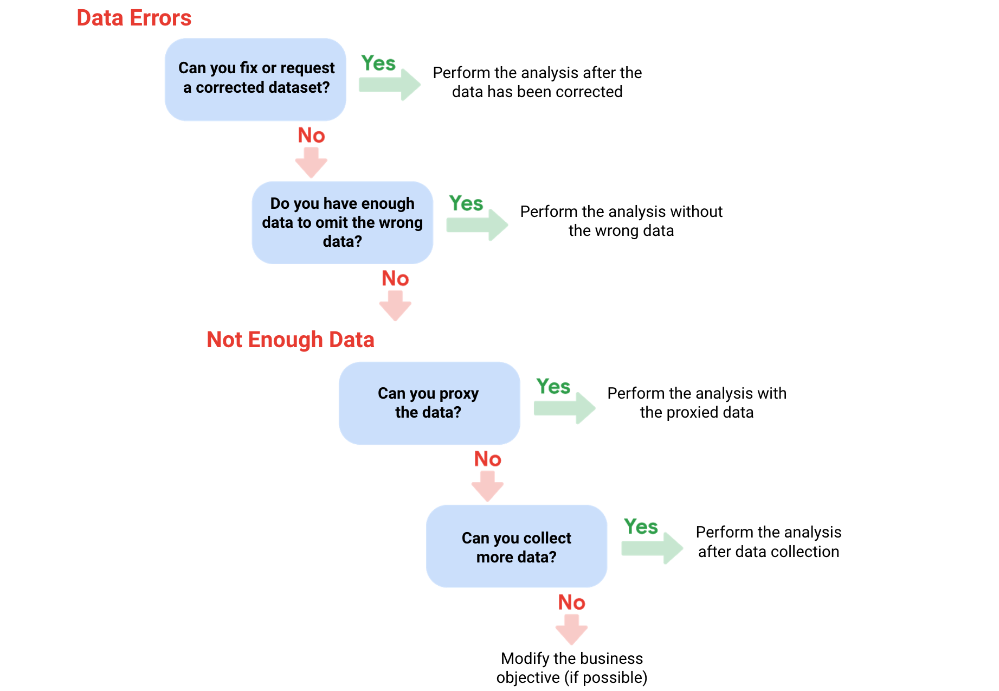

# Process Data from Dirty to Clean

## C​ourse content

1. **E​nsuring data integrity**. Data integrity is necessary to ensure a successful analysis. In this part of the course, you will explore methods and steps that analysts take to check data for integrity. This includes knowing what to do when you have an insufficient amount of data. You will also learn about sample size, avoiding sample bias, and using random samples. All of these measures also help to ensure a successful data analysis.

2. **U​nderstanding clean data**. Every data analyst wants clean data to work with when performing an analysis. In this part of the course, you will learn the difference between clean and dirty data. You will practice data cleaning techniques in spreadsheets and other tools.

3. **C​leaning data using SQL**. Knowing a variety of ways to clean data can make an analyst’s job much easier. In this part of the course, you will use SQL to clean data from databases. You will explore how SQL queries and functions can be used to clean and transform your data before an analysis.

4. **V​erifying and reporting cleaning results**. Cleaning data is an important step in the data analysis process. In this part of the course, you will verify that data is clean and report data cleaning results. With verified clean data, you will be ready for the next step in the data analysis process.

5. **(​Optional) Adding data to your resume**. Creating an effective resume will help you in your data analytics career. In this part of the course, you will learn all about the job application process. Your focus will be on building a resume that highlights your strengths and relevant experience. 

6. **C​ompleting the Course Challenge**. At the end of this course, you will be able to apply what you have learned in the Course Challenge. The Course Challenge will ask you questions about the key concepts and then will give you an opportunity to put them into practice as you go through prepared scenarios.

## Week 1

### Data integrity

> Data integrity is the accuracy, completeness, consistency, and trustworthiness of data throughout its lifecycle.

### Insufficient data

**Types of insufficient data**
* Data from only one source
* Data that keeps updating
* Outdated data
* Geographically-limitated data

**Ways to address insufficient data:**
* Identify trends with the available data
* Wait for more data if time allows
* Talk with stakeholders and adjust your objective
* Look for a new dataset

### What to do when you find an issue with your data

#### Data issue 1: no data

**Possible Solutions**

1. Gather the data on a small scale to perform a preliminary analysis and then request additional time to complete the analysis after you have collected more data. 

2. If there isn’t time to collect data, perform the analysis using proxy data from other datasets. 
This is the most common workaround.

#### Data issue 2: too little data

**Possible Solutions**
1. Do the analysis using proxy data along with actual data.
2. Adjust your analysis to align with the data you already have.

#### Data issue 3: wrong data, including data with errors

**Possible Solutions**
1. If you have the wrong data because requirements were misunderstood, communicate the requirements again.
2. Identify errors in the data and, if possible, correct them at the source by looking for a pattern in the errors.
3. If you can’t correct data errors yourself, you can ignore the 
wrong data and go ahead with the analysis if your sample size is still large enough and ignoring the data won’t cause systematic bias.

***Important note:*** sometimes data with errors can be a warning sign that the data isn’t reliable. Use your best judgment.

## Week 2

## Week 3

## Week 4